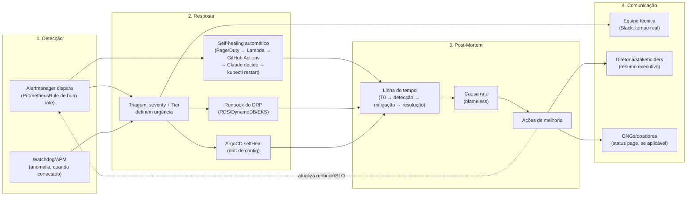

# ITSM/AIOps — Ciclo de Vida do Incidente

> Requisito do Hackathon Fase 5 (seção *ITSM e AIOps — Gestão Preditiva*): *"ativar funcionalidade de IA do APM (ex: Watchdog no Datadog...) para detectar anomalias automaticamente"* + *"desenhar o ciclo de vida do incidente da aplicação: da detecção (via AIOps/alerta) à resposta e comunicação aos stakeholders"*.

Este documento cobre as duas partes do requisito: (1) o estado real da detecção automática hoje — o que já funciona e o que ainda depende de uma peça externa não disponível nesta conta educacional —, e (2) o desenho do ciclo de vida completo do incidente, do alerta até a comunicação pós-incidente.

## 1. Ciclo de vida do incidente



O ciclo fecha em loop: as ações de melhoria de um post-mortem retroalimentam os runbooks e os limiares de alerta, reduzindo o MTTR do próximo incidente — mesma lógica documentada em [`mttr.md`](./mttr.md).

## 2. Detecção

### 2.1 O que já está implementado e é real hoje

Diferente do restante deste documento (que é desenho, não medição), a camada de detecção abaixo é **configuração de verdade**, versionada e sincronizável via ArgoCD (`alert-rules`, sync-wave `0`, depende do `kube-prometheus-stack` já estar de pé):

- **[`alerting/prometheusrule-slo-burn.yaml`](../alerting/prometheusrule-slo-burn.yaml)** — 9 regras de alerta (3 por serviço), estilo *multi-window burn rate* do Google SRE Workbook, calculadas em cima dos SLOs já formalizados em [`sli-slo-sla.md`](./sli-slo-sla.md):
  - **Burn rápido** (`SLOErrorBudgetBurnFast`, janela 5m): erro 5xx consumindo o budget de 30 dias a mais de 14× o ritmo sustentável — `severity: critical` só para `donation-service` (Tier 0, Hot Path); `warning` para `ngo-service`/`volunteer-service` (Tier 1), refletindo o mesmo tratamento diferenciado por Tier usado no DRP e no dashboard SRE.
  - **Burn lento** (`SLOErrorBudgetBurnSlow`, janela 1h): mesmo princípio, limiar mais baixo (6×), pega degradações mais graduais que o burn rápido não capturaria a tempo.
  - **Latência** (`SLOLatencyBudgetBurn`, janela 1h): proporção de requisições acima do limite do SLO (250ms `donation-service` / 500ms `ngo-service`/`volunteer-service`) consumindo o budget de latência mais rápido que o sustentável.
- **Roteamento no Alertmanager** (`values/kube-prometheus-stack.yaml`, chave `alertmanager.config`): alertas `severity=critical` vão para `#solidary-tech-incidentes-criticos` (repetição a cada 1h enquanto ativo), `severity=warning` para `#solidary-tech-alertas` (repetição a cada 4h) — dois canais Slack, agrupados por `alertname`+`service`. A URL do webhook do Slack vem de um Secret (`alertmanager-slack-webhook`) provisionado fora deste repositório, mesmo padrão já usado pra `datadog-secret` em `values/otel-collector.yaml` — nunca versionar a URL em texto plano.

Isso já é, por si só, uma forma legítima (e mais simples de auditar) de "detecção automática de anomalia": em vez de regras de threshold fixo (ex.: "alerta se latência > 300ms"), o burn rate normaliza o alerta contra o *orçamento de erro* de cada serviço — o mesmo princípio por trás do Watchdog, só que com um motor estatístico mais simples (limiar fixo sobre uma janela) em vez de detecção de anomalia por baseline histórico.

### 2.2 IA do APM (Datadog Watchdog) — o que falta pra ativar de verdade

O Watchdog do Datadog analisa as métricas de APM (a mesma telemetria OTel que os 3 microsserviços já emitem, roteada pro `otel-collector` → exporter `datadog`, ver `values/otel-collector.yaml`) e detecta automaticamente:

- Anomalias de latência/taxa de erro por serviço, comparando contra o baseline histórico do próprio serviço (não um limiar fixo escrito à mão).
- Correlação entre serviços dependentes (ex.: se `donation-service` degrada logo depois de um deploy ou de uma degradação no RDS).
- Insights automáticos ("Watchdog Insights") sem precisar configurar regra nenhuma — é habilitado por padrão assim que o APM recebe tráfego real.

**Por que ainda não está ativo neste projeto**: o Watchdog roda inteiramente do lado do Datadog — não existe `Terraform`/manifesto que o "ligue"; ele já vem ativo assim que uma conta Datadog real recebe os traces. O bloqueio é o mesmo já registrado no restante do projeto (`CLAUDE.md`): não há Agent/conta Datadog configurada nesta conta educacional (AWS Academy Learner Lab não tem integração com Datadog, e a conta Datadog em si nunca foi criada/paga para este projeto). O `exporter: datadog` no Collector já está pronto e só precisa de uma `DD_API_KEY` real no Secret pra os traces começarem a chegar — a partir daí o Watchdog liga sozinho, sem trabalho adicional.

**Consequência prática**: a detecção *de fato* rodando hoje é a camada Prometheus/Alertmanager da seção 2.1 — que não depende de nenhum serviço pago externo e cobre exatamente as mesmas duas Golden Metrics (latência, erros) exigidas pelo enunciado. O Watchdog, quando/se uma conta Datadog real for conectada, se soma a essa camada (mais anomalias sutis, sem regra escrita à mão) — não a substitui, já que o burn rate de SLO é um conceito específico de confiabilidade que o Watchdog genérico não modela da mesma forma.

## 3. Resposta

### 3.1 Resposta automatizada — self-healing com Claude

Além do disparo pro Slack, alertas `severity=critical` (hoje só `donation-service`
— é a única regra com essa severidade, ver seção 2.1) também abrem um incidente
no PagerDuty (`pagerduty_configs`, `values/kube-prometheus-stack.yaml`). Isso
alimenta um segundo caminho de resposta, **automático e sem aprovação humana**
(decisão explícita do usuário — restart roda direto, não é só uma sugestão):

```
PagerDuty (incidente criado)
  → webhook V3 (incident.triggered) → Lambda-ponte
      (fiap-tech-challenge-fase-5-infra, module.incident_bridge)
        → repository_dispatch → GitHub Actions
            (.github/workflows/incident-response.yml)
              → aiops/incident_response.py: Claude (Sonnet 5, tool-use)
                analisa o incidente e decide se um "kubectl rollout restart"
                do serviço afetado é uma ação sensata
                  → se sim: executa o restart, posta o resultado no Slack,
                    resolve o incidente no PagerDuty
                  → se não (causa não é do tipo que restart resolve, ex.
                    dependência externa fora do ar): só explica o porquê
```

Isso roda **em paralelo** à triagem humana (R1) — o self-healing não substitui
o plantão, é uma primeira tentativa de mitigação mais rápida que qualquer
humano consegue reagir, enquanto o plantão ainda está sendo notificado.
Detalhe completo (allowlist de serviços, variáveis de ambiente, como testar
localmente com um payload simulado, e os dois pontos do protocolo do
PagerDuty que não foram confirmados ao vivo contra a documentação oficial)
em [`aiops/README.md`](../../fiap-tech-challenge-fase-5-infra/aiops/README.md)
no repo de infra.

**Por que isso é AIOps de verdade, não só automação de script**: a decisão de
*se* vale a pena reiniciar não é uma regra fixa (`if severity == critical:
restart()`) — é uma inferência do modelo em cima do texto do incidente,
raciocinando sobre se o sintoma descrito é do tipo que um restart resolve.
Isso é o mais próximo que este projeto chega da "IA do APM" pedida no
enunciado sem depender de uma conta Datadog paga (seção 2.2): em vez de IA
*detectando* anomalia, é IA *decidindo a resposta* a uma anomalia já
detectada pelo Prometheus.

### 3.2 Resposta manual (demais cenários)

Disparo do alerta (Slack) → o time de plantão (papel "Quem detecta o incidente" do [DRP, seção 8](../../fiap-tech-challenge-fase-5-infra/docs/drp/DRP.md#8-papéis-e-responsabilidades)) faz a triagem inicial usando os labels do alerta:

| Label do alerta | Usado para |
|---|---|
| `severity` | Prioridade de atendimento (`critical` = interromper o que está fazendo; `warning` = próxima folga na fila) |
| `service` + `tier` | Qual runbook consultar e se doações em andamento estão em risco (só `tier="0"` = `donation-service`) |
| `slo_type` | Se o sintoma é latência ou disponibilidade — direciona qual painel do dashboard SRE abrir primeiro |

A partir daí, a resposta segue o que já existe no projeto, sem reinventar nada:

- **Causa é infraestrutura (RDS/DynamoDB/cluster)** → segue o runbook correspondente do DRP ([`rds-restore.md`](../../fiap-tech-challenge-fase-5-infra/docs/drp/runbooks/rds-restore.md), [`dynamodb-restore.md`](../../fiap-tech-challenge-fase-5-infra/docs/drp/runbooks/dynamodb-restore.md), [`eks-velero-restore.md`](../../fiap-tech-challenge-fase-5-infra/docs/drp/runbooks/eks-velero-restore.md)).
- **Causa é drift de configuração no cluster** → `selfHeal: true` do ArgoCD (todas as Applications) já reverte automaticamente — frequentemente resolve antes de um humano terminar a triagem.
- **Causa não é óbvia** → distributed tracing no Datadog APM (quando conectado) ou os painéis de log (Loki) do dashboard SRE, span por span, ver [`mttr.md`](./mttr.md#onde-cada-componente-entra).

## 4. Post-Mortem

Todo incidente com `severity=critical`, e qualquer `warning` que exigiu intervenção manual, gera um post-mortem usando o template [`postmortem-template.md`](./postmortem-template.md) — blameless (foco em processo/sistema, não em quem executou), com linha do tempo, causa raiz e ações de melhoria com dono e prazo. Mesmo espírito do [`drills/TEMPLATE.md`](../../fiap-tech-challenge-fase-5-infra/docs/drp/drills/TEMPLATE.md) do DRP, mas para incidentes reais em vez de simulados.

## 5. Comunicação aos stakeholders

| Público | Canal | Quando | Conteúdo |
|---|---|---|---|
| Equipe técnica (on-call) | Slack (`#solidary-tech-incidentes-criticos`/`#solidary-tech-alertas`) | Em tempo real, automático (Alertmanager) | Alerta bruto — `service`, `severity`, `summary`, link pro dashboard |
| Diretoria/stakeholders do projeto | Resumo executivo (e-mail/reunião) | Após resolução de qualquer incidente Tier 0, ou semanalmente se só Tier 1 | Impacto em doações (se houve), tempo de indisponibilidade, causa raiz em 1 parágrafo, ação de melhoria — sem jargão técnico, mesmo tom do PCN executivo citado no `CLAUDE.md` |
| ONGs parceiras / doadores | Status page ou e-mail direto (não implementado neste projeto educacional) | Só se o incidente afetou `donation-service` (Tier 0) por período perceptível | Aviso simples: o que aconteceu, se alguma doação precisa ser reconferida, quando foi resolvido |

A comunicação para ONGs/doadores está desenhada mas não implementada (não existe status page nem lista de e-mail neste projeto) — é a mesma lacuna de "camada de apresentação executiva" já registrada no `CLAUDE.md` para o PCN.

## 6. O que falta pra isso ser real (honestidade)

- **Nunca sincronizado contra um cluster real** — mesma ressalva de todo o resto deste repositório (ver `README.md`, seção "Status Atual"). As regras de burn rate nunca dispararam de verdade; a sintaxe foi revisada manualmente, não validada com `promtool` (sem binário disponível neste ambiente).
- **Secret `alertmanager-slack-webhook` não existe ainda** — precisa ser criado no cluster (`kubectl create secret generic alertmanager-slack-webhook --from-literal=webhook-url=<url>`) antes do Alertmanager conseguir notificar; sem ele, o Pod do Alertmanager falha ao montar o volume do secret.
- **Watchdog** depende de uma conta Datadog real conectada (seção 2.2) — não vai ligar nesta conta educacional.
- **Nenhum incidente real ainda ocorreu** — este documento desenha o processo; o primeiro drill (ver [`drills/TEMPLATE.md`](../../fiap-tech-challenge-fase-5-infra/docs/drp/drills/TEMPLATE.md) do DRP, que serve tanto para restore quanto para testar este ciclo de detecção→resposta→comunicação) é o próximo passo natural para gerar um post-mortem de verdade e validar os limiares de burn rate contra tráfego real.
- **Self-healing (seção 3.1) nunca disparou contra PagerDuty/EKS reais** — o código (Lambda-ponte + agente Claude) foi testado com lógica pura e payload simulado (`aiops/fixtures/sample_incident.json`), mas nunca ponta a ponta: falta criar a "Webhook Subscription" V3 no PagerDuty apontando pra `function_url` da Lambda, configurar `pagerduty_configs` no Alertmanager com uma routing key real, e popular os Secrets do GitHub Actions (`ANTHROPIC_API_KEY`, `AWS_*`, `EKS_CLUSTER_NAME`, `INCIDENT_SLACK_WEBHOOK_URL`, `PAGERDUTY_API_TOKEN`/`PAGERDUTY_FROM_EMAIL`).
- **Dois formatos do protocolo do PagerDuty não confirmados ao vivo** — a verificação de assinatura do webhook (`x-pagerduty-signature`) e o corpo do `PUT /incidents/{id}` pra resolver o incidente foram implementados com o formato mais estabelecido conhecido, mas a documentação do PagerDuty é renderizada via JS e não pôde ser confirmada por `WebFetch` nesta sessão — usar o botão de "enviar webhook de teste" do PagerDuty pra validar antes de confiar nisso num incidente real (ver `aiops/README.md`).
